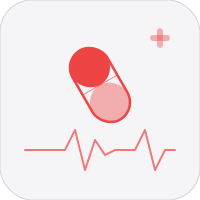
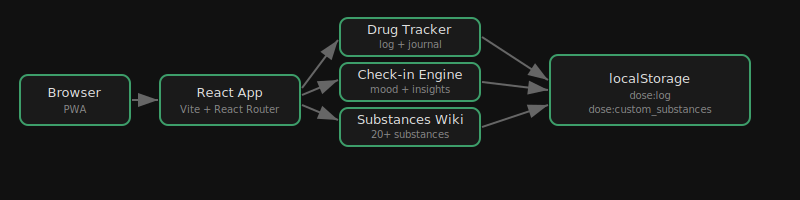

<div align="center">

# Dose



Personal substance tracker, harm reduction wiki, and health dashboard. Log doses, check drug interactions, browse chemistry data, track tolerance and washout periods, monitor biometrics, and export to CSV. Fully offline, no backend.

</div>


## Architecture



## Stack

- React 19 + Vite
- React Router v7 (hash routing)
- Chart.js + react-chartjs-2
- localStorage — no backend, fully offline

## Features

- **Dashboard** -- active stack overview, quick-log entry
- **Journal** -- full dose log with filters and search
- **Substances** -- searchable wiki grid with harm reduction data
- **Chemistry** -- periodic table of pharmacology, molecular data
- **Interactions** -- drug interaction checker against active stack
- **Tolerance** -- tolerance tracker with washout period alerts
- **Health** -- daily check-ins (sleep, exercise, nutrition, smoking)
- **Biometrics** -- weight, blood pressure, heart rate tracking
- **Insights** -- usage heatmap, frequency stats, radar charts
- **CSV Export** -- export full dose log to CSV

## Dev

```bash
npm install
npm run dev
npm test
npm run build
```

Opens at http://localhost:5173.

## Roadmap

- [x] Drug interaction checker
- [x] Tolerance tracking with washout periods
- [x] Export to CSV
- [x] Chemistry / pharmacology page
- [x] Health check-ins
- [x] Biometrics tracking
- [ ] Custom substance creation
- [ ] Mood and sleep correlation
- [ ] Apple Health sync
- [ ] OCR pill identification
- [ ] Calendar integration

## Quick Commands
- `./scripts/simplify.sh` - normalize project structure
- `./scripts/monetize.sh . --write` - generate monetization plan (if available)
- `./scripts/audit.sh .` - run fast project audit (if available)
- `./scripts/ship.sh .` - run checks and ship (if available)
