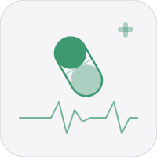
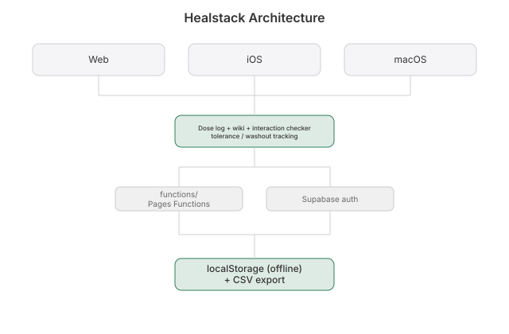

# Healstack
  [](https://github.com/nulljosh/healstack)
**Live:** https://healstack.heyitsmejosh.com

Know what you took, when, and what it does with everything else you're on.

A dose log, a harm reduction wiki, and a health dashboard. All of it stays on your device.

## Features
- Log a dose. Journal it, filter it, search it
- A wiki of 200+ substances with harm reduction data
- Interaction checks against what you're already on
- Tolerance tracking with washout alerts
- Daily check-ins and biometrics
- Heatmap, frequency, insights
- CSV export. Fully offline, in localStorage

## Run
```bash
npm install && npm run dev   # localhost:5173
npm test
npm run build
vercel --prod
```

## Roadmap
- [ ] Reset login credentials to jatrommel@gmail.com (store the new password in Keychain, never in the repo)
- [ ] Add a forgot-password / reset-password flow
- [ ] Propagate the forgot-password flow to every app in the codebase that has login or registration
- [ ] Custom substance creation
- [ ] Mood and sleep correlation with Apple Health sync
- [ ] OCR pill identification
- [ ] Lab PDF parsing — import bloodwork PDFs, parse values, flag out-of-range
- [ ] iOS companion app — log doses, view active stack, interaction warnings natively
- [ ] Reflexology and breathing modules (expansion from harm reduction into general wellness)
- [ ] Declutter UI — reduce visual noise, simplify navigation
- [ ] Claude/Apple Liquid Glass redesign (backdrop-filter blur, -apple-system font, #0071e3)
- [ ] Vibe clone portfolio aesthetic
- [ ] Multi-profile support — create profiles, transfer personal data between them

## Changelog
v1.3.0
- Portfolio vibe: Geist font, flat monochrome palette, spring animations, no shadows.

v1.1.0
- Added dose logging with journal, filters, and search.
- Built the substance wiki with harm reduction data and interaction checking.
- Shipped health check-ins, biometrics, insights, and offline CSV export.

## License
MIT 2026 Joshua Trommel

## Whitepaper

[Technical whitepaper](WHITEPAPER.md)

## API and agent tools

An agent can drive this app. [`docs/API.md`](docs/API.md) lists the HTTP surface, where there
is one, and the WebMCP tools registered on `document.modelContext`. Tools come in three kinds:
read-only, writes you can undo, and the few that ask a human first.

## Architecture


